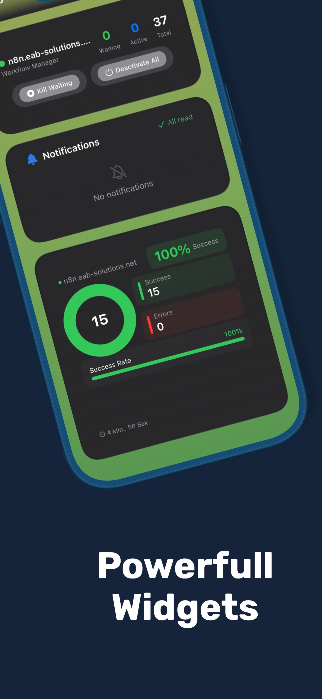
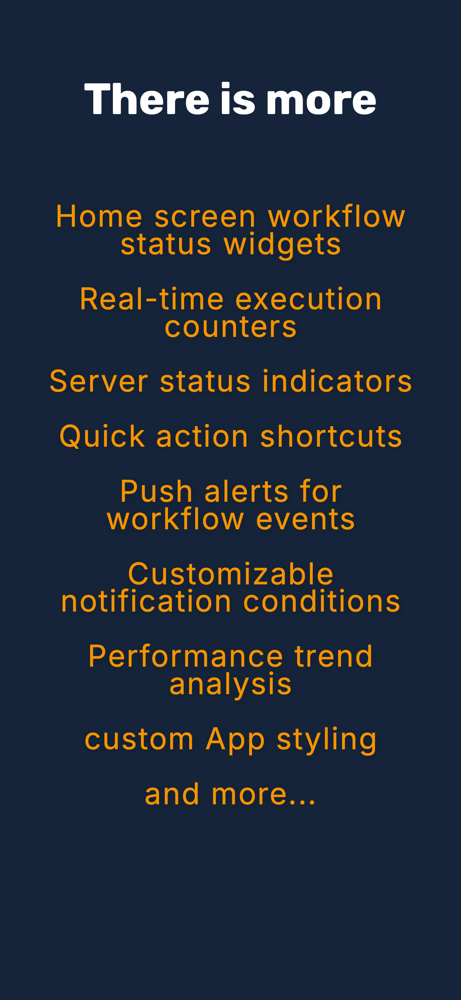
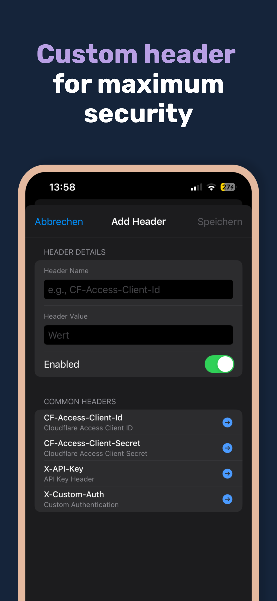
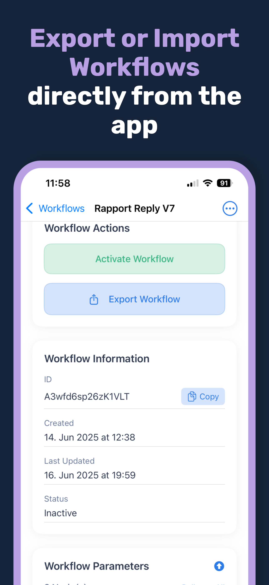
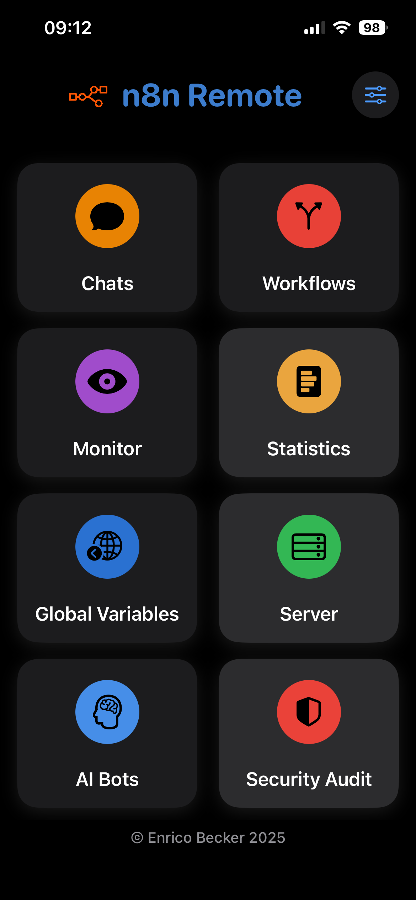

# neightn_remote - Your n8n workflows in your pocket 📱

<div align="center">
  
  
  [](https://apps.apple.com)
  [](https://n8n.io)
  [](https://developer.apple.com/xcode/swiftui/)
  [](LICENSE)
  
  **The first professional iOS app built specifically for n8n workflow management**
  
  Transform your iPhone into a mobile command center for your self-hosted n8n instances - monitor, manage, and control remotely.
</div>

---

## 🚀 Why neightn_remote?

Ever had a critical workflow fail at 3 AM? Need to check execution statistics during your commute? Want to activate workflows with just your voice? **neightn_remote** is built for the modern DevOps professional who needs instant access to their automation infrastructure - anytime, anywhere.

### 🎯 Key Benefits

- **📱 Mobile-First Design** - Native iOS performance, not a web wrapper
- **🚨 Emergency Ready** - Fix critical issues without opening a laptop
- **🎙️ Voice Control** - "Hey Siri, ask my bot about system status"
- **📊 Real-Time Monitoring** - Live execution data and statistics
- **🔐 Enterprise Security** - Built-in security auditing and SSL/TLS validation
- **⚡ Native Performance** - SwiftUI-based for smooth, responsive experience

## 📱 Core Features

### Server Management
- 🔌 Connect to multiple n8n instances via API Key or Basic Auth
- 🔒 Custom headers for enterprise setups
- ✅ SSL/TLS connection validation
- 📡 Live server connection status

### Workflow Control
- 📋 Complete workflow overview
- ▶️ Activate/deactivate workflows instantly
- 🔄 Real-time status updates
- 🎯 Bulk operations for multiple workflows

### Execution Monitoring
- 📊 Live execution statistics
- ✅ Success/failure tracking
- ⏳ Identify "waiting" executions
- 📝 Detailed execution logs
- 📈 Performance metrics dashboard

### AI Bot Integration (iOS 16+)
- 🤖 Configure AI bots for n8n Chat Triggers
- 🎙️ **Siri Integration**: "Hey Siri, ask my analytics bot..."
- 💬 Voice-to-text input
- 🔗 Multiple bot configurations

### iOS Native Features
- 📱 Home Screen Widgets for instant status
- 🌓 Dark/Light mode support
- 📲 iPad-optimized layouts
- ⚡ iOS Shortcuts integration
- 🔔 Push notifications (coming soon)

### Premium Features
- 🌍 Global Variables Management (7-day free trial)
- ☁️ Cloud synchronization for teams
- 📊 Advanced analytics
- 🔐 Enhanced security features

## 🎯 Real-World Use Cases

### 🚨 Emergency Response
> **3 AM Server Alert**: Your e-commerce workflow crashes. Check status from bed, view error logs, and restart workflows - all without opening a laptop.

### 📊 Daily Operations
> **Morning Commute**: Review overnight execution statistics, identify bottlenecks, and plan optimizations during your train ride.

### 🎙️ Hands-Free Management
> **While Driving**: "Hey Siri, ask my monitoring bot if all systems are running" - get instant status updates without touching your phone.

### 👥 Team Coordination
> **In Meetings**: Quickly check and report system status - "All 23 workflows active, 99.2% success rate this week."

## 📸 Screenshots

<div align="center">
  
  
  
  
  
</div>

## 🎯 Who Is This For?

### DevOps Professionals
- Manage 50+ workflows across environments
- Need mobile access for on-call duties
- Value security and audit capabilities

### Self-Hosting Enthusiasts
- Run n8n on home servers or VPS
- Want mobile control of automations
- Appreciate privacy and local control

### Small Business Owners
- Use n8n for business automation
- Need reliable monitoring without complexity
- Require mobile access for continuity

### Automation Consultants
- Manage n8n for multiple clients
- Need professional tools for demos
- Require advanced features and reporting

## 🚀 Getting Started

### Prerequisites
- iOS 15.0 or later
- n8n instance (self-hosted or cloud)
- API Key or Basic Auth credentials

### Installation
1. Download from the [App Store](https://apps.apple.com) (link coming soon)
2. Open neightn_remote
3. Add your n8n server:
   - Enter server URL
   - Choose authentication method
   - Add API key or credentials
4. Test connection
5. Start managing your workflows!

### Quick Setup Guide
```
1. Server URL: https://your-n8n.domain.com
2. Authentication: API Key (recommended)
3. Test Connection → Success ✅
4. You're ready to go! 🚀
```

## 💡 What Makes Us Different

### vs. Mobile Browser
- ✅ Native performance and offline capabilities
- ✅ Push notifications and widgets
- ✅ Siri voice commands
- ✅ Better mobile UX than web interface

### vs. Generic API Clients
- ✅ n8n-specific features
- ✅ Security auditing built-in
- ✅ Template browser integration
- ✅ Workflow-aware monitoring

### vs. Desktop-Only
- ✅ Emergency access anywhere
- ✅ Commute productivity
- ✅ Voice control capabilities
- ✅ Always-available monitoring

## 🛠️ Technical Details

- **Platform**: iOS 15.0+, iPadOS 15.0+
- **Framework**: SwiftUI (100% native)
- **Languages**: Swift 5.9
- **Architecture**: MVVM with Combine
- **Security**: Keychain integration, SSL pinning
- **Performance**: Optimized for 10,000+ daily executions

## 📊 Success Metrics

- Used by power-users with **100+ workflows**
- Manages instances with **10,000+ daily executions**
- Active in **15+ countries**
- **5-star rating** from power users

## 🗺️ Roadmap

### Currently Working On
- 🔔 Push notifications for workflow failures
- 📊 Enhanced widget customization
- 🔐 Additional security audit features
- ♿ Accessibility improvements

### Community Requested
- 👥 Team collaboration features
- 📈 Advanced analytics and reporting
- 🏢 Multi-tenant management
- 🔌 More platform integrations

## 🤝 Community & Support

- **Documentation**: [Full documentation](Documentation/FEATURES.md)
- **Issues**: [Report bugs](https://github.com/yourusername/neightn_remote/issues)
- **Discussions**: [Join the conversation](https://github.com/yourusername/neightn_remote/discussions)
- **n8n Community**: [n8n Forum](https://community.n8n.io)

## 📄 License

This project is licensed under the MIT License - see the [LICENSE](LICENSE) file for details.

## 🙏 Acknowledgments

- The amazing [n8n team](https://n8n.io) for building an incredible automation platform
- The n8n community for feedback and feature requests
- All beta testers who helped shape this app

---

<div align="center">
  <strong>Built with ❤️ for the n8n community</strong>
  <br>
  <em>Transform your iPhone into an n8n command center</em>
  <br><br>
  <a href="https://apps.apple.com">Download on the App Store</a>
</div>